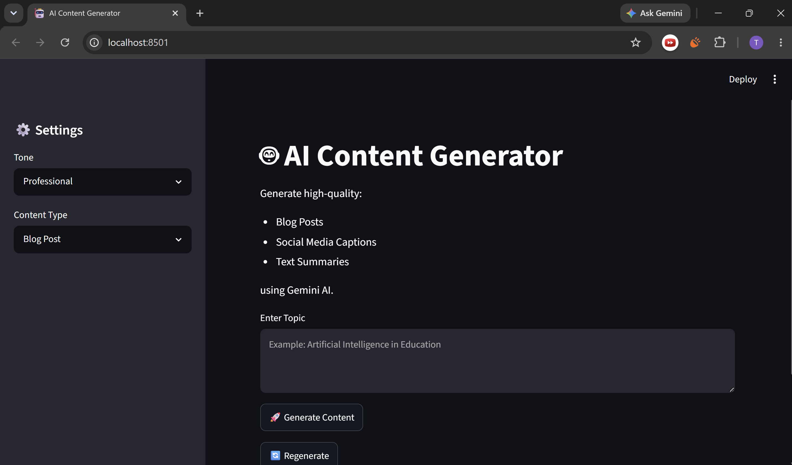
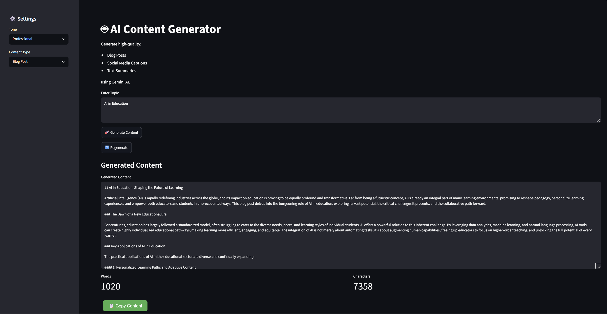
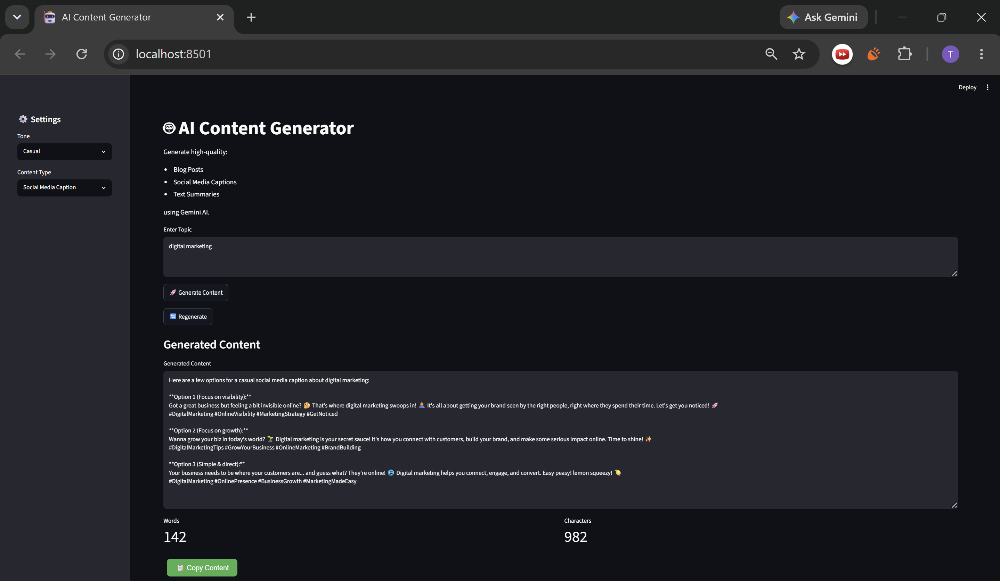
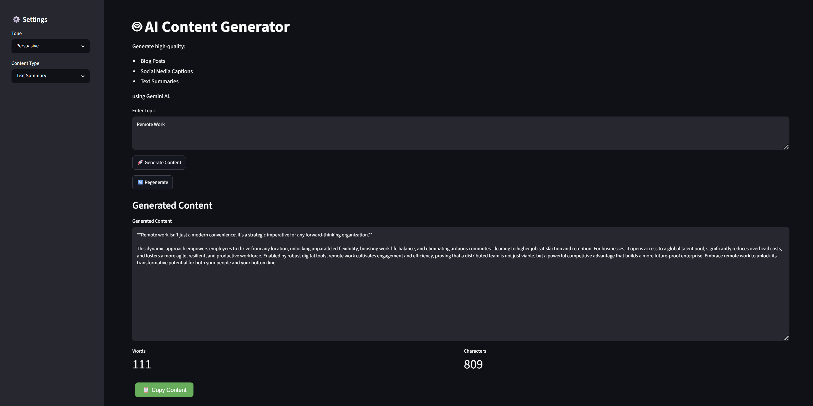

# Task 2: 🤖 AI Content Generator

##  Overview

AI Content Generator is a Streamlit based web application powered by Google's Gemini AI. It helps users generate different types of content such as blog posts, social media captions, and text summaries based on a given topic and tone.

The application provides a simple and interactive interface for creating high-quality content instantly.

---
## Features

- **AI-Powered Content Generation** : Uses Google's Gemini AI to generate high-quality content based on user input.

- **Multiple Content Types** : Supports Blog Posts, Social Media Captions, and Text Summaries for different content needs.

- **Custom Tone Selection** : Allows users to generate content in Professional, Casual, Friendly, or Persuasive tones.

- **Regenerate Content** : Instantly creates a new version of the content without changing the selected settings.

- **Copy to Clipboard** : Enables users to quickly copy the generated content with a single click.

- **Word Count Tracking** : Displays the total number of words in the generated content.

- **Character Count Tracking** : Shows the total number of characters for better content management.

- **Interactive Streamlit Interface** : Provides a simple, clean, and user-friendly web interface.

- **Error Handling** : Handles missing inputs, API-related issues, and invalid requests gracefully.

- **Real-Time Content Generation** : Generates content within seconds using Gemini AI's fast response capabilities.

---

##  Technologies Used

- **Python** – Used as the core programming language for developing the application logic and integrating AI functionalities.

- **Streamlit** – Used to build the interactive and user-friendly web interface for content generation.

- **Google Gemini API** – Powers the AI content generation by creating blog posts, social media captions, and text summaries based on user inputs.

- **python-dotenv** – Manages environment variables securely and helps keep API keys protected.

- **HTML** – Used for creating custom UI elements within the Streamlit application.

- **JavaScript** – Implements the Copy-to-Clipboard functionality for generated content.


---
## Folder Structure

```text
week2_task3_AI_content_generator/
│
├── app.py
├── requirements.txt
├── README.md
├── .gitignore
├── .env.example
│
└── Screenshots/
    ├── HomePage.png
    ├── BlogPost.png
    ├── SocialMediaCaption.png
    └── TextSummary.png
```

---

##  Installation

### 1. Clone the Repository

```bash
git clone [<repository-url>](https://github.com/TraptiJain23/WeIntern_AI_Internship)
cd week2_task3_AI_content_generator
```

### 2. Install Required Dependencies

```bash
pip install -r requirements.txt
```

### 3. Configure Environment Variables

Create a `.env` file in the project root directory and add your Gemini API key:

```env
GEMINI_API_KEY=YOUR_API_KEY_HERE
```

### 4. Run the Application

```bash
streamlit run app.py
```

### 5. Access the Application

Once the server starts, open the local URL displayed in the terminal (usually `http://localhost:8501`) in your browser.

---

##  How to Use

1. Enter a topic.
2. Select a tone.
3. Choose a content type:
   - Blog Post
   - Social Media Caption
   - Text Summary
4. Click **Generate Content**.
5. View the generated content.
6. Use:
   - **Regenerate** button for a new version.
   - **Copy Content** button to copy the output.
7. Check word count and character count.

---

##  Screenshots

### Home Page


### Blog Post Generation


### Social Media Caption Generation


### Text Summary Generation


---

## Future Enhancements

- PDF Export
- Content History
- Multiple Language Support
- Additional Content Types
- Dark Mode Support

---

## Author
Trapti Jain
(Developed as part of an AI Internship Project using Streamlit and Gemini AI.)
